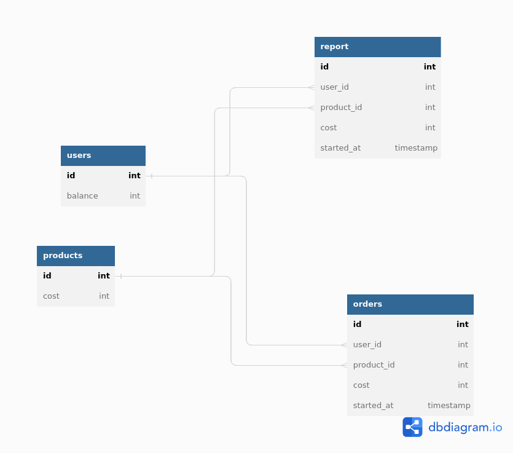

### Инструкция по запуску

Запуск

```
docker compose up --build web
```

У меня Docker-compose не даёт получить запрос с постмена к контейнеру ни на Линукс, ни на Виндоус. Проблему решить не получилось, хотя кажется, что всё должно работать.

### База данных

Схема базы данных выглядит следующим образом:



*  `users` - ID пользователя и баланс
*  `products` - ID продукта/услуги и стоимость
*  `orders` - ID заказа/резервного счёта, ID пользователя, ID услуги, время заказа, стоимость
*  `report` - ID заказа/резервного счёта, ID пользователя, ID услуги, время заказа, стоимость., но уже прошедшее признание выручки

В качестве СУБД используется PostgreSQL:12, запросы к библиотеке осуществляются с помощью стандартной библиотеки SQL и pg. Реализация REST-api с помощью GIN.

По умолчанию сервис не содержит в себе никаких данных о балансах. Данные о балансе появляются при первом зачислении средств.

### Доступные методы

#### 1. Метод начисления средств на баланс пользователя

Доступ через Postman:

```
POST localhost:8080/balance/change
```

сопутствующий json:

```json
{
    "id": 1,
    "balance": 500
}
```

с помощью данного метода также реализуется снятие средств, помимо пополнения баланса:

```json
{
    "id": 1,
    "balance": -500
}
```

А также инициализация пользователя, если id не занят.

**Описание**: принимает на *вход* `id int`, `balance int`, после чего обращается к базе данных `users` для обновления текущего баланса пользователя (при этом баланс пользователя не может быть ниже нуля). На *выходе* мы получаем json с информацией об окончании операции. Если операция закончилась безуспешно, то добавляется сообщение с описанием ошибки.

#### 2. Метод получения баланса пользователя 

Доступ через Postman:

```
GET localhost:8080/balance/find
```

сопутствующий json:

```json
{
    "id": 3
}
```

**Описание**: 

Принимает *на вход* `id int`, после чего обращается к базе данных `users`, чтобы *на выходе* получить текущий баланс пользователя в формате json.

#### 3. Метод резервирования средств с основного баланса на отдельном счете

Доступ через Postman:

```
POST localhost:8080/balance/reserve
```

сопутствующий json:

```json
{
    "id": 2,
    "user_id": 1,
    "product_id": 2,
    "cost": 100
}
```

**Описание**: 

Принимает *на вход* в формате json id заказа/счёта, id пользователя, id услуги, сумму. Списывает средства с баланса пользователя в `users` и добавляет их с информацией по заказу в таблицу `orders`. *На выходе* json с информацией об успехе/неудаче операции и соответствующим сообщением.

#### 4. Метод признания выручки

Доступ через Postman:

```
POST localhost:8080/accept_revenue
```

сопутствующий json:

```json
{
    "id": 1,
    "UserId": 2,
    "ProductId": 3,
    "Cost": 100
}
```

**Описание**: 

Принимает *на вход* в формате json id пользователя, id услуги, id заказа, сумму. Списывает средства с резервного счёта `orders` и добавляет их с информацией по заказу в таблицу `reports`. *На выходе* json с информацией об успехе/неудаче операции и соответствующим сообщением.

#### 5. Разрезервирование средств с отдельного счёта

Доступ через Postman:

```
POST localhost:8080/balance/unreserve
```

сопутствующий json:

```json
{
    "id": 1
}
```

**Описание**: 

Принимает *на вход* в формате json id заказа (резервного счёта). Списывает средства с резервного счёта `orders` и добавляет их обратно на баланс пользователя. *На выходе* json с информацией об успехе/неудаче операции и соответствующим сообщением.

#### 6. Метод для получения месячного отчета

Доступ через Postman:

```
GET localhost:8080/month_report
```

сопутствующий json:

```json
{
    "month": 11,
    "year": 2022
}
```

**Описание**: 

Принимает *на вход* в формате json месяц и год. Обращается к таблице `reports` для отбора подходящих по времени данных. Далее происходит запись данных в .csv-файл для вывода. *На выходе* либо json с сообщением об ошибке, либо csv-файл.

#### 7. Метод получения списка транзакций пользователя

Доступ через Postman:

```
GET localhost:8080/operation_report
```

сопутствующий json:

```json
{
    "id": 1,
    "sortByDate": true,
    "sortBySum": false,
    "descending":true 
}
```

**Описание**: 

Принимает в формате json id пользователя и параметры сортировки:

* по дате
* по общей сумме
* от большего к меньшему или наоборот

Сортировку можно выбрать только одну или не выбирать. В случае если поставить оба параметра `true`, то будет сортировка по дате в силу логики программы. Также для удобства чтения добавлена нумерация каждой отдельной операции в json. *На выходе* json либо с информацией об ошибке, либо с отсортированными операциями.

#### 8. Перевод средств от пользователя к пользователю

Доступ через Postman:

```
POST localhost:8080/transaction
```

сопутствующий json:

```json
{
    "id_from": 1,
    "id_to": 3,
    "cost": 1100
}
```

**Описание**: 

Принимает *на вход* в формате json id отправителя, id получателя и сумму. Списывает средства с баланса отправителя и добавляет их к балансу получателя. *На выходе* json с информацией об успехе/неудаче операции.

#### Вопросы по разработке

1. В техническом задании указано, что список полей к методами не фиксированный, а "перечислен лишь необходимый минимум". В связи с этим я не стал пытаться уменьшить количество аргументов там, где это было возможно. Например В признании выручки можно было бы подавать только номер заказа `orderID`, так как он является уникальным, а следовательно по нему можно без проблем восстановить сопутствующие свойства заказа.
2. Не совсем было понятно, что подразумевалось под "Реализовать сценарий разрезервирования денег, если услугу применить не удалось": нужно просто перенести средства обратно пользователю или же ещё и удалить соответствующий заказ в таблице `orders`? В связи с этим было решено просто производить разрезервацию без последующего удаления заказа, так как в конечном счёте это не играла никакой роли в данной реализации.
3. Были также вопросы по поводу того, как должен выглядить резервный счёт: должен ли он быть отдельной таблицей от таблицы заказов? По итогу было решено объединить резервный счёт с информацией о заказах.
